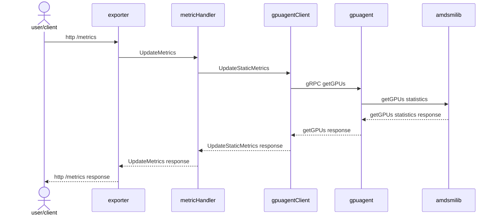
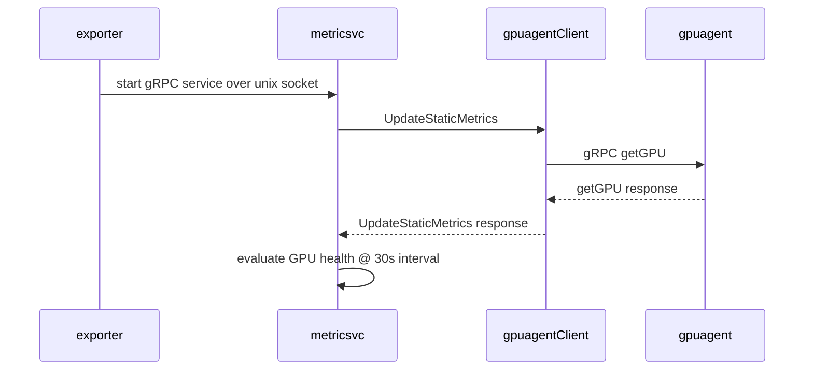
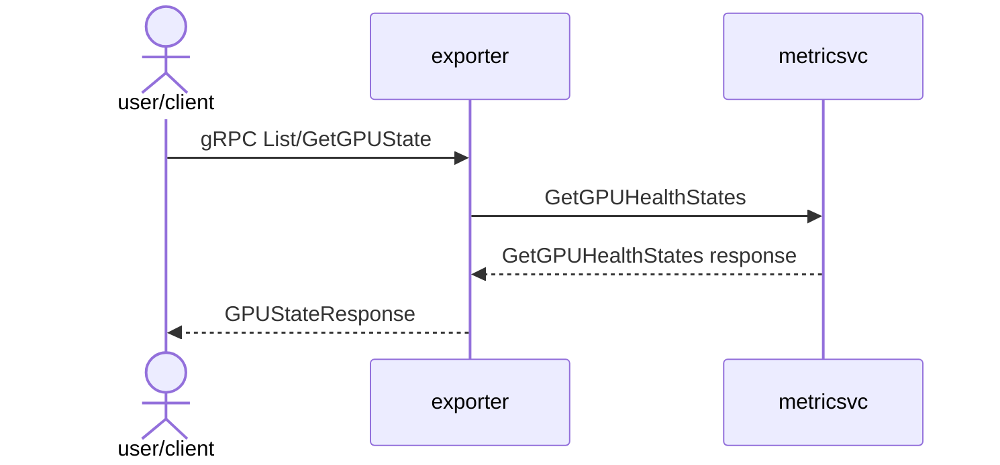

# Developer Guide

This document provides build instructions and guidance for developers working on the AMD Device Metrics Exporter repository.

## Git submodule setup

Make sure to update the submodules on every pull from the repository.
```bash
git submodule update --init --recursive
```

## Environment Setup

The project Makefile provides a easy way to create a docker build container that packages the Docker and Go versions needed to build this repository. The following environment variables can be set, either directly or via a `dev.env` file:

- `DOCKER_REGISTRY`: Docker registry (default: `docker.io/rocm`).
- `DOCKER_BUILDER_TAG`: Docker build container tag (default: `v1.0`).
- `BUILD_BASE_IMAGE`: Base image for Docker build container (default: `ubuntu:22.04`).
- `EXPORTER_IMAGE_NAME`: Metrics exporter container name (default: `device-metrics-exporter`).
- `EXPORTER_IMAGE_TAG`: Metrics exporter container tag (default: `latest`).
- `TESTRUNNER_IMAGE_NAME`: Test runner image name (default: `test-runner`).
- `UBUNTU_VERSION`: Ubuntu version for builds (`jammy` for 22.04, `noble` for 24.04).

## Build Prerequisites

Before starting, ensure you have Docker installed and running with the user permissions set appropriately.

## Quick Start

To quickly build everything using Docker:
```bash
make default
```

The default target creates a docker build container that packages the developer tools required to build all other targets in the Makefile and builds the `all` target in this build container.

## Building Components

### Build and Launch Docker Build Container Shell

Run the following command to start a Docker-based build container shell:

```bash
make docker-shell
```

This gives you an interactive Docker environment with necessary tools pre-installed. It is recommended to run all other Makefile targets in this build environment.

### Compiling the AMD Device Metrics Exporter

To compile from within the build environment, run:

```bash
make all
```

This command builds:
- AMD Metrics Exporter
- Proto-generated code
- Metrics utility
- AMD Test Runner

**Note**: AMD Test Runner builds are currently disabled in this branch. Please use prebuilt images to deploy test runner until support for building the component is added here.

### Building a Debian Package

To build a Debian package for Ubuntu:

```bash
make pkg
```

This will create `.deb` packages in the `bin` directory.

### Build Docker images

Build standard exporter image:

```bash
make docker
```

### Testing

To run unit tests in `pkg/`:

```bash
make unit-test
```

To run end-end tests:

```bash
make e2e
```

**Note**: End-end tests run on mock AMD Metrics Exporter image that mocks the metrics generated.

### Helm Chart Packaging

To package Helm charts:

```bash
make helm-charts
```

## GPU Agent Integration

The AMD Device Metrics Exporter relies on [GPU Agent](https://github.com/ROCm/gpu-agent.git), which provides programmable APIs to configure and monitor AMD Instinct GPUs. GPU Agent enables low-level interactions with the GPUs, facilitating the collection and reporting of device-specific metrics.

### Building GPU Agent

Developers can make changes directly in the GPU Agent repository, build the GPU Agent binary, and then integrate the built binaries into the Device Metrics Exporter project. Copy over the static binary into the `assets` folder in the AMD Device Metrics Exporter and follow these steps:

#### Build Container (one time)
```bash
make gpuagent-build
```

#### Compile GPU Agent
```bash
make gpuagent-compile
```


## Build AMD SMI
This is a built out of [AMD SMI Lib](git@github.com:ROCm/amdsmi.git), to
access AMD GPU hardware driver

#### Build Container (one time)
```bash
make amdsmi-build
```

#### Compile AMDSMI
```bash
make amdsmi-compile
```

## Architecture
 
### Metrics HTTP Server Request Handling


### Health Monitoring And gRPC Service


### Health gRPC Request Handling

